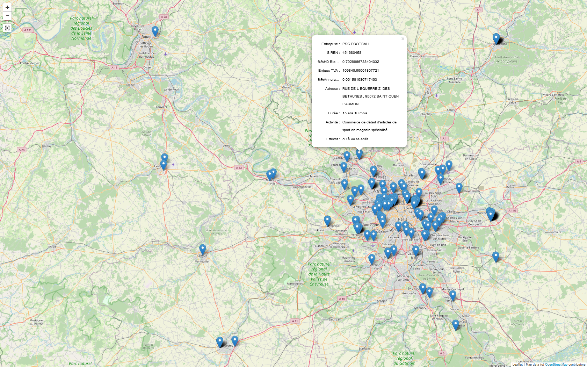
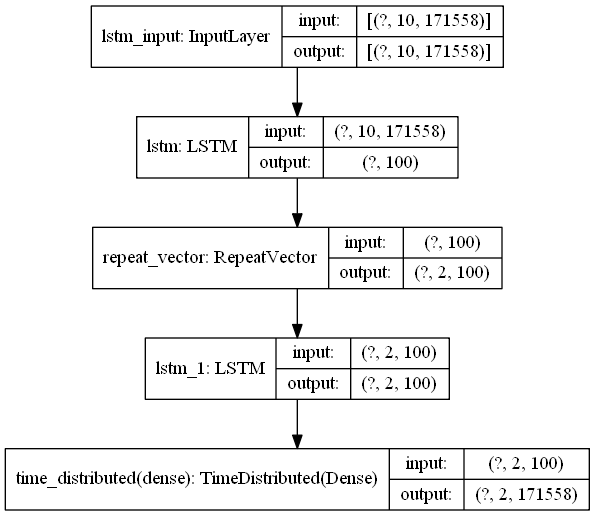
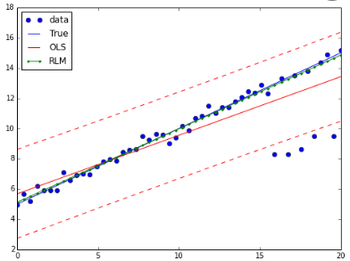

# Portfolio (Main projects)
---
## Fraud detection in Detax Information System

Developped from scratch the Custom fraud detection system on Detax transactions (Up to 20k a day)

A progressive strategy from data-analysis towards an automated fraud detection system: 

**Data knowledge:** A baseline report, focused on keys facts:  financial issues, main products and retailers, risk analysis. 

**Data Cartography:** A minimal cartography to detect detax shops in anomalous areas. 

**Buisness rules for fraud detection:** A daily scoring tool of detax transactions. Based on 27 buisness rules on detaxed products, retailers and customers purchase history. 

**ML System for fraud detection:** Enhanced baseline system with a ML methodology. Learned the non-compliant transactions footprint with the "control at the boarder" database. Deployed tool for a daily scoring.

Stack : Spark, Scikit-learn, Ipyleaflet, Conda.

---
## Deep learning for multivariate Time Series prediction

**Context:** Multivariate prediction is crucial for Customs analysts. Detecting trends and shift can be challenging while monitoring high number of goods and origins of imports in parallel. Moreover, shifts sometimes reflect a fraudulent behavior: while the shift in the clearance behavior is coupled with the introduction of an Anti-Dumping-Duty, risk of falsly declared good or origin sometimes occurs.  

**Methods:** Adapted a seq-to-seq methodology, methods mainly used in NLP to perform a weekly prediction of aggregated values imported, at scale. Used tensors of 10 weeks x n-channels x m-batches to predict the next 2 weeks x n-channels x m-batches. Compared 4 differents models, encoder-decoder variations. Performed residual analysis.

**Data:** Historic of 257 weeks of customs imports. 209 weeks for training-set, 48 for the test set.  

**Results:** Highly scalable methods, allows a prediction with a high number of channels on a weekly basis. Cardinalty and data sparsity can be a challenge. Need to find more robust methods on non stationnary time series, with missing values. 

Stack : Spark, Tensorflow-Keras, Jupyter.

---
## Detecting undervalued imports using linear regression

**Context:** Undervalutations occurs when an importer deliberately underevaluate the value of the imported good on the custom declaration. The main implication is a reduction of a VAT and Customs duties payed at the border. Detecting undervaluations at scale is then crucial in order to garantee EU member state ressources. 

**Methods:** For most of the goods, an intrinsic relation between price payed and quantities imported can be constated. Thus, linear methods can be used to estimate, for each goods and origin of import, the main link between price and quantities imported. Potential fraudulent transactions are those failing to follow the pattern of the majority of data where for a given quantities imported, the price is slighty lower than other imports of the same product and origin.

**Data:** Customs goods which follows a linear trend between quantities and weights (ex: fabrics)

**Results:** Trimestrial evaluation and training and risk assessment.

Stack : Spark, Stat_models, Gitlab CI/CD. Ansible.

---

© 2022 Nathan Nougué. Powered by Jekyll and the Minimal Theme.

